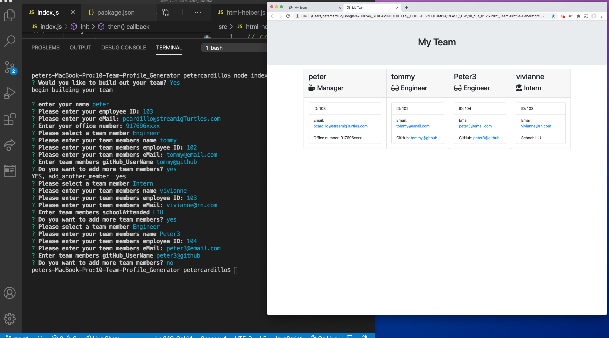

  # Project Title: HW 10 Team Profile Generator
    
  ## Table of Contents:
  - [Project Description](#project-description)
  - [Installation Instructions](#installation-instructions)
  - [Project Usage Information](#project-usage-information)
  - [Contribution Guidelines](#contribution-guidelines)
  - [Testing Instructions](#testing-instructions)
  - [License Type](#license-type)
  - [Github Repo Link](#github-repo-link)
  - [Github Live Web Link](#github-live-web-link)
  - [Github Information](#github-information)
  - [my-email-for-questions-and-information](#my-email-for-questions-and-information)
  - [Video Demo of this App running](https://drive.google.com/file/d/1SH0pPhN4_EQtXqROm5jkCi3u9nQb4zDF/view)
  - [Video Demo of Jest Class Tests](https://drive.google.com/file/d/1SDcIpdKO2kFS4XUlrT0SQyPcJtQLMzT_/view)

  &nbsp;
  - - -
  ## Screenshot of App running in the terminal:
  

  &nbsp;
  - - -
  ## Screenshot of Jest Class Testing:
  

  &nbsp;
  - - -
  ## Screenshot of Jest Class Testing:
  

  &nbsp;
  - - -
  ## Project Description:
  - This is a NODE.js command line application that takes in information about employees on a software engineering team.  The app will generate an HTML webpage displaying information for each person.  For each of the employees there will be a unit test written to ensure code maintenance.  Please see the video link of a demo of this app in the TOC.

  &nbsp;
  - - -
  ## Installation Instructions:
  - Please run npm install at the command line  to acquire all the necessary dependencies used to build this application.  Which includes jest (our testing platform used), require(allowing user input at the console). 

  &nbsp;
  - - -
  ## Project Usage Information:
  - To run the app, type node index.js at the command line.  You will be asked a series of information questions about the employees on the software engineering team.  Once all informaton is entered for each of the Engineers, Intern & Manager - an HTML.index file will be generated displaying their information.  Please see screenshot of the generated HTML.index page.

  &nbsp;
  - - -
  ## Contribution Guidelines:
  - I made this, Peter Cardillo, PAC with Streaming Turtles, LLC

  &nbsp;
  - - -
  ## Testing Instructions:
  - To test the application, run the following command in the terminal >node index.js  -  then a series of questions will prompt you for an input.  More testing instructions to follow that test the actual code that runs the index.js app. 

  &nbsp;
  - - -
  ## License Type:
  - 

  &nbsp;
  - - -
  ## gitHub Repo Link:
  - https://github.com/streamingTurtles/10-Team-Profile-Generator

  &nbsp;
  - - -
  ## Github Live Web Link:
  - https://streamingturtles.github.io/10-Team-Profile-Generator/

  &nbsp;
  - - -
  ## Github Information:

  
- user name: streamingTurtles
- [GitHub Profile](https://github.com/streamingTurtles)

  ## my-email-for-questions-and-information:
  - pcardillo@streamingTurtles.com  

  &nbsp;
- - -
- - -
Peter Cardillo, Columbia Engineering Fullstack Bootcamp, 2020-2021  
